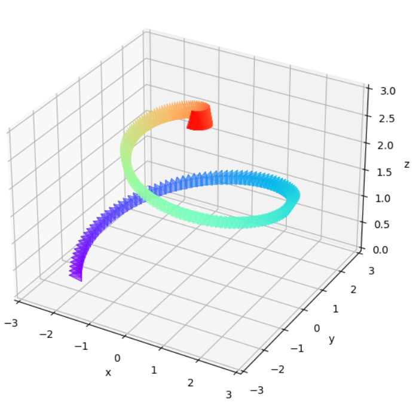

<h1 align="center">NeRF!</h1>

<center>A pytorch-lightning reimplementation of NeRF (Neural Radiance Fields).

<span></span>
<span></span>

<p float="center">
  
   
  
</p>

NeRF is a technique to represent 3D scenes using a neural network. Inspired by how light traverses the real world, NeRFs can render photorealistic scenes, including view-specific lightning changes and high-frequency details.

</center>


# Setup

This runs with Python 3.9+. Install all dependencies:

```
pip install -r requirements.txt
```

# Train

## Configurations

All parameters (regarding the raysampler, model, training hyperparams) can be specified in the config file, as seen in `configs/full.yaml`. The default parameters are in `configs/default.py`.

## Dataset

Refer to `datasets/nerf.py` for details on the expected data format. The code currently assumes that all camera poses are in OpenGL's coordinate frame. The data should look similar to the existing dataset in `data/bottles`.

## Model

There are two models provided in this implementation - a tiny NeRF for quick testing and the full implementation as seen in the appendix.
Specify `model=nerf` or `model=tiny-nerf` in the config file to use either.

## Run

Run `train.py` to run to the training script or alternatively, use the `colab_file.ipynb` notebook to run it in a Jupyter notebook.

## Logging

If logged into weights and biases, the entire training process will automatically be logged, including some sample outputs per validation run.

# Predict

Run `eval.py` to evaluate the model on a test set. Alternatively, replace `test` with `predict` in the script to generate predictions on a new set of poses.

# Notes

Implementing NeRF was surprisingly simple, the sheer number of resources online made it easy. The challenging part was ensuring that every component worked. Some recollections:

1. Ensure that the coordinate systems are correct - even when using external libraries - PyTorch3D for instance, doesn't use one coordinate system for all components. [This](https://ai-workshops.github.io/building-and-working-in-environments-for-embodied-ai-cvpr-2022/Section-4-Debug.pdf) is a good resource on the coordinate systems used in various libraries (OpenCV, OpenGL).

2. Visualise the poses - this way you can get a sense of how the poses are distributed in the dataset. [This](https://github.com/demul/extrinsic2pyramid) was a great resource to easily visualise all poses.


3. Visualise the raysampler - this way you can ensure that the rays are enveloping the object. The notebook `notebooks/RaySampler Test.ipynb` does just that. When you see something like this: you can be confident that your raysampler works.


4. Train on high-resolution images! This should've been obvious but training on higher resolution images will give a better performance than doing any number of tricks on a lower resolution.

# References

The structure of this implementation was largely inspired by Pytorch 3D's implementation.

1. https://keras.io/examples/vision/nerf/#visualize-the-training-step
2. https://pytorch3d.org/tutorials/fit_simple_neural_radiance_field
3. https://github.com/krrish94/nerf-pytorch
4. https://github.com/yenchenlin/nerf-pytorch
5. https://docs.nerf.studio/en/latest/nerfology/model_components/visualize_samplers.html
6. https://dtransposed.github.io/blog/2022/08/06/NeRF/ (love the visuals)